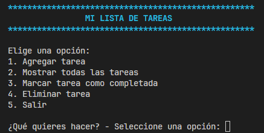
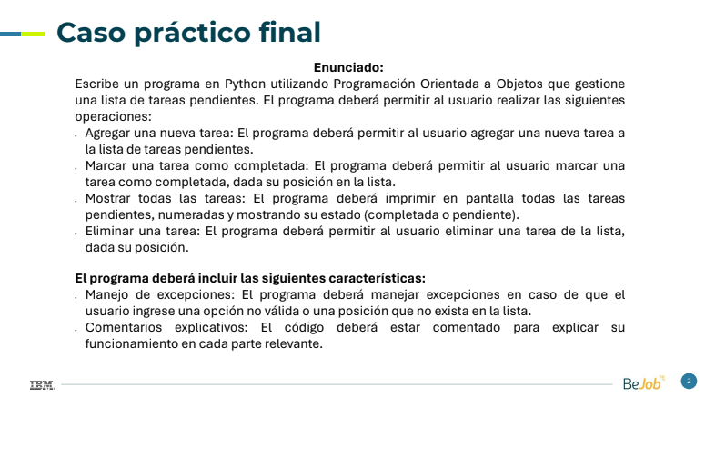

# IBM SkillsBuild - Curso Python

## Gestor de Tareas en Python (Caso Práctico Final)

Este es un programa en Python que gestiona una lista de tareas pendientes utilizando Programación Orientada a Objetos (POO). Permite al usuario agregar nuevas tareas, marcar tareas como completadas, mostrar todas las tareas pendientes y eliminar tareas de la lista.

## Características

- **Agregar una nueva tarea:** Permite al usuario agregar una nueva tarea a la lista de tareas pendientes.
- **Marcar una tarea como completada:** Permite al usuario marcar una tarea como completada, dada su posición en la lista.
- **Mostrar todas las tareas:** Imprime en pantalla todas las tareas pendientes, numeradas y mostrando su estado (completada o pendiente).
- **Eliminar una tarea:** Permite al usuario eliminar una tarea de la lista, dada su posición.

El programa incluye manejo de excepciones para entradas inválidas y comentarios explicativos en el código para facilitar su comprensión.

## Requisitos

- Python 3.x instalado en tu sistema.
- Colorama: Puedes instalarlo mediante `pip install colorama`.

## Uso

1. Clona o descarga este repositorio en tu máquina.
2. Abre una terminal y navega hasta el directorio donde se encuentra el archivo `main.py`.
3. Ejecuta el programa con el comando `python main.py`.
4. Sigue las instrucciones en pantalla para gestionar tus tareas.

## Contribuciones

¡Las contribuciones son bienvenidas! Si encuentras algún problema o tienes alguna mejora para el programa, por favor abre un issue o una pull request en este repositorio.
